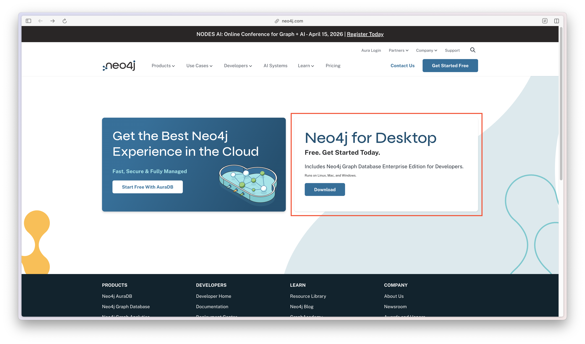
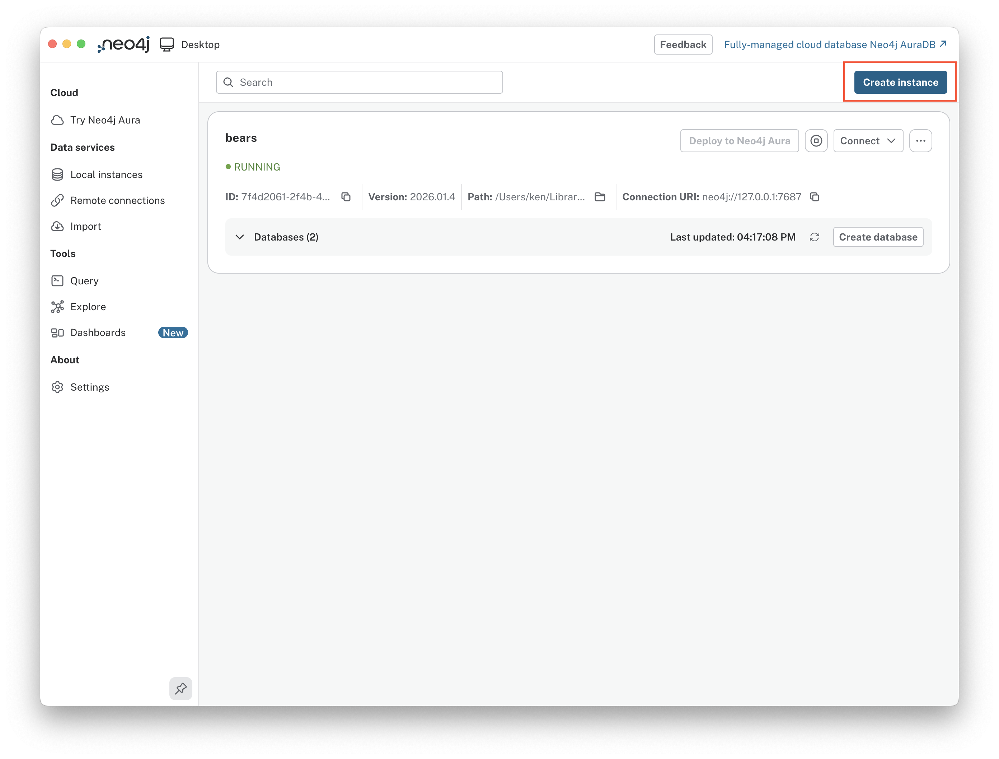
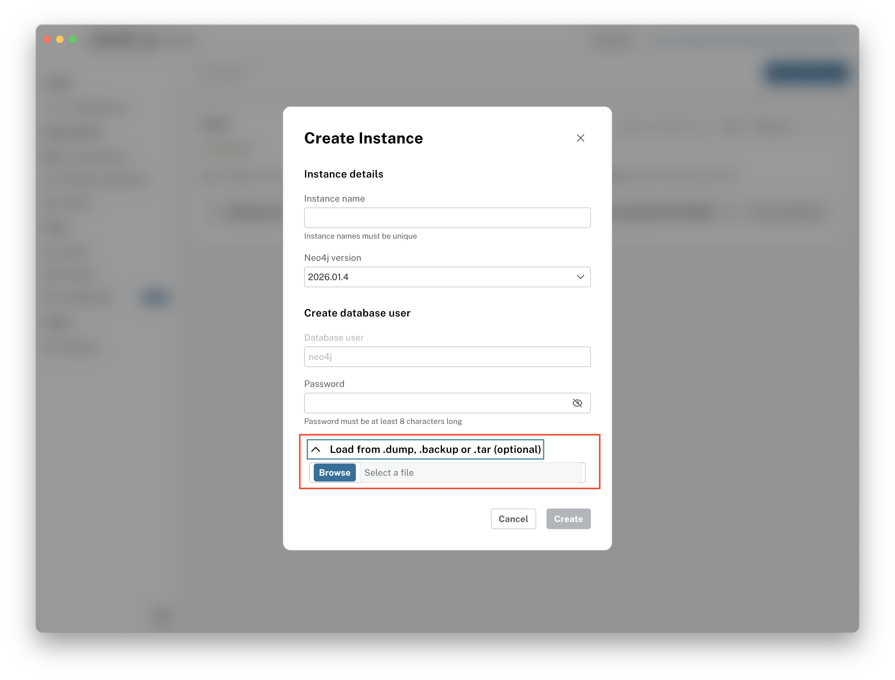
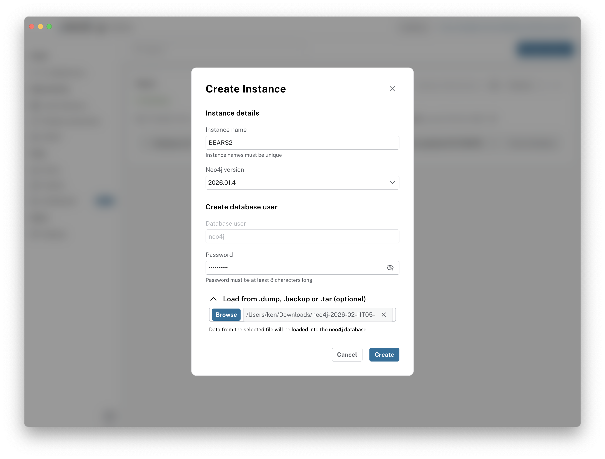
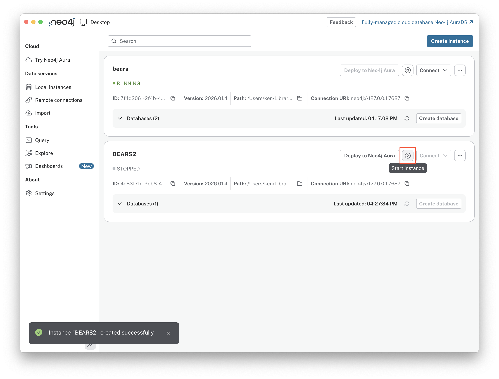
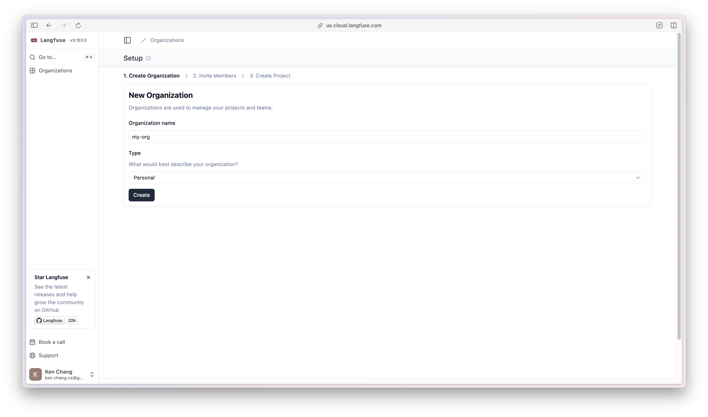

# BEARS — Router-Guided Agentic RAG Orchestrator

BEARS 是一個多 Agent RAG（Retrieval-Augmented Generation）系統。透過 LLM Router 分析使用者問題，動態調度不同 RAG Agent，最後由 Orchestrator 回傳最佳答案。

## 架構總覽

```
User Question
      │
      ▼
┌──────────┐
│  Router   │  ← LLM 分類意圖，選擇最適合的單一 Agent
└────┬─────┘
     │  route to best agent
     ▼
┌─────────┐  ┌──────────┐  ┌───────────┐
│ Hybrid  │  │    KG    │  │  Agentic  │   ← 各 Agent 獨立 retrieve + generate
└────┬────┘  └────┬─────┘  └─────┬─────┘
     │            │              │
     └────────────┼──────────────┘
                  ▼
            Final Answer
```

## 目錄結構

```
BEARS/
├── src/bears/                      # 主要套件
│   ├── core/                       # 系統設定 + 實驗參數
│   │   ├── config.py               #   Pydantic Settings + .env（secrets）
│   │   ├── experiment.py           #   Pydantic BaseModel + YAML（實驗參數）
│   │   └── langfuse_helper.py      #   Langfuse observability
│   ├── database/                   # 資料層
│   │   ├── vector/                 #   ChromaDB 向量儲存 + 資料載入
│   │   │   ├── vector_store.py     #     ChromaDB 連線 + CRUD
│   │   │   └── vector_builder.py   #     載入 corpus → 建立向量 DB
│   │   └── graph/                  #   Neo4j 圖譜儲存 + 建構
│   │       ├── graph_store.py      #     Neo4j 連線 + CRUD
│   │       └── graph_builder.py    #     LLM 實體抽取 → 建立圖譜
│   ├── router/                     # 路由層
│   │   ├── base.py                 #   BaseRouter ABC + RouterOutput
│   │   └── llm_router.py          #   GPT-4o-mini 分類路由
│   ├── agents/                     # Agent 層
│   │   ├── base.py                 #   BaseRAGAgent ABC + AgentResponse
│   │   ├── registry.py             #   Agent 註冊表（動態 import）
│   │   ├── hybrid_agent/           #   向量搜尋 + 多查詢擴展 + RRF 融合
│   │   ├── kg_agent/               #   知識圖譜 5 節點 pipeline
│   │   ├── agentic_agent/          #   多步驟迭代檢索
│   │   └── multimodal_agent/       #   Stub（未來擴充）
│   ├── orchestrator/               # 編排層（LangGraph StateGraph）
│   │   ├── state.py                #   OrchestratorState
│   │   ├── nodes.py                #   router / agent wrapper 節點
│   │   └── graph.py                #   StateGraph 組裝 + 入口函式
│   └── evaluation/                 # 評估系統
│       ├── schemas.py              #   SourceMetrics, QuestionDetail
│       ├── metrics.py              #   Hit Rate, MRR, MAP
│       ├── evaluator.py            #   AgentEvaluator + OrchestratorEvaluator
│       └── cli.py                  #   CLI 入口（bears-eval）
├── scripts/                        # 工具腳本
│   └── build_db.py                 #   建立向量 + 圖譜資料庫
├── experiments/                    # 實驗參數 YAML（進 git）
│   └── default.yaml
├── data/                           # 資料
│   ├── corpus.json                 #   ~4200 篇文件（drcd / hotpotqa / 2wiki）
│   ├── queries.json                #   ~647 題評估問題
│   └── chroma_db_corpus/           #   ChromaDB 持久化資料
├── output/                         # 評估結果輸出（不進 git）
├── pyproject.toml
└── .env.example
```

## 快速開始

### 前置需求

- Python >= 3.11
- [uv](https://docs.astral.sh/uv/)（套件管理器）
- OpenAI API Key
- Neo4j 資料庫（KG Agent 需要）

### 1. 安裝

```bash
git clone <repo-url> && cd BEARS
git checkout dev

# 安裝所有依賴
uv sync
```

### 2. 設定 Neo4j（KG Agent 需要）

#### 2.1 下載 Neo4j Desktop

前往 [neo4j.com/download/](https://neo4j.com/download/) 下載 Neo4j Desktop：



#### 2.2 建立實例

開啟 Neo4j Desktop，點擊右上角 **Create instance**：



#### 2.3 匯入備份檔案

在 Create Instance 對話框中，展開底部的 **Load from .dump, .backup or .tar (optional)**，放入備份檔案：



#### 2.4 填寫資訊

填入 Instance name、密碼，並確認已選擇備份檔案，點擊 **Create**：



#### 2.5 啟動資料庫

建立完成後，點擊 **Start instance** 啟動資料庫：



### 3. 設定 Langfuse（LLM 追蹤）

前往 [us.cloud.langfuse.com](https://us.cloud.langfuse.com) 註冊並登入。

#### 3.1 建立組織

在開始頁面點擊 **+ New Organization**：


輸入組織名稱，點擊 **Create**：



#### 3.2 建立專案

輸入專案名稱（如 `BEARS`），點擊 **Create**：


#### 3.3 建立 API 金鑰

進入 **Settings → API Keys**，點擊 **+ Create new API keys**，將產生的 Secret Key 和 Public Key 記下，稍後填入 `.env`：


### 4. 設定環境變數

```bash
cp .env.example .env
```

編輯 `.env`，填入 API Key、Neo4j 連線資訊（步驟 2）和 Langfuse 金鑰（步驟 3）：

```env
OPENAI_API_KEY=sk-...
NEO4J_URI=neo4j://127.0.0.1:7687
NEO4J_USERNAME=neo4j
NEO4J_PASSWORD=your_password
LANGFUSE_SECRET_KEY=sk-lf-...
LANGFUSE_PUBLIC_KEY=pk-lf-...
LANGFUSE_HOST=https://us.cloud.langfuse.com
```

### 5. 建立向量資料庫

```bash
# 建立向量 + 圖譜資料庫
uv run python scripts/build_db.py

# 只建向量（ChromaDB）
uv run python scripts/build_db.py --vector-only

# 只建圖譜（Neo4j）
uv run python scripts/build_db.py --graph-only

# 限制文件數量（快速測試）
uv run python scripts/build_db.py --limit 100
```

## 使用方式

### CLI 評估（主要流程）

```bash
# 測試指令（十筆資料）
uv run bears-eval --agent hybrid --limit 10 --output output/hybrid.json --detailed
uv run bears-eval --agent kg --limit 10 --output output/kg.json --detailed
uv run bears-eval --agent agentic --limit 10 --output output/agentic.json --detailed
uv run bears-eval --orchestrator --limit 10 --output output/orchestrator.json

# 評估單一 agent
uv run bears-eval --agent hybrid
uv run bears-eval --agent kg
uv run bears-eval --agent agentic

# 指定實驗參數
uv run bears-eval --agent hybrid --config experiments/default.yaml

# 限制題數（快速測試）
uv run bears-eval --agent hybrid --limit 10

# 分開存檔
uv run bears-eval --agent hybrid --output output/hybrid.json
uv run bears-eval --agent kg --output output/kg.json
uv run bears-eval --agent agentic --output output/agentic.json

# 詳細逐題結果
uv run bears-eval --agent hybrid --detailed

# 只看失敗的題目
uv run bears-eval --agent hybrid --detailed --failures-only

# 評估 orchestrator（Router → Agent）端到端
uv run bears-eval --orchestrator
```

#### CLI 參數一覽

| 參數 | 說明 | 預設值 |
|------|------|--------|
| `--agent NAME` | 評估指定 agent（hybrid / kg / agentic） | — |
| `--orchestrator` | 評估完整 orchestrator pipeline | — |
| `--config PATH` | 實驗參數 YAML | None（使用預設值） |
| `--queries PATH` | 題目 JSON 檔 | `data/queries.json` |
| `--limit N` | 限制評估題數 | 全部 |
| `--output PATH` | 輸出檔案路徑 | `output/results.json` |
| `--detailed` | 輸出逐題詳細結果 | False |
| `--failures-only` | 搭配 `--detailed`，只輸出判定失敗的題目 | False |

#### 評估輸出格式

```json
{
  "overall": {
    "total_questions": 647,
    "hit_rate": 0.85,
    "partial_hit_rate": 0.72,
    "mrr": 0.68,
    "map": 0.55,
    "generation_pass_rate": 0.70,
    "avg_total_time": 3.2
  },
  "by_source": {
    "drcd": { "..." },
    "hotpotqa": { "..." },
    "2wiki": { "..." }
  },
  "by_question_type": {
    "single-hop": { "..." },
    "multi-hop": { "..." }
  }
}
```

### Python API

```python
import asyncio
from bears.agents.registry import get_agent
from bears.core.experiment import ExperimentConfig

# 單一 Agent
exp = ExperimentConfig.from_yaml("experiments/default.yaml")
agent = get_agent("hybrid", experiment=exp)
result = asyncio.run(agent.run("台灣第一座國家公園是哪座？"))
print(result.answer)
print(result.retrieved_doc_ids)

# Orchestrator（Router → Agent）
from bears.orchestrator.graph import run_orchestrated_rag
result = asyncio.run(run_orchestrated_rag("美國銷售額第二大汽車租賃公司的執行長是誰？"))
print(result["answer"])
```

## 可用 Agent

| 名稱 | 策略 |
|------|------|
| `hybrid` | 多查詢擴展 → 向量搜尋 → RRF 融合 → LLM 生成 |
| `kg` | 查詢擴展 → 向量+圖譜擴展 → LLM 重排序 → 圖譜檢索 → 推理生成（5 節點 pipeline） |
| `agentic` | 多步驟迭代檢索 → 逐步 LLM 重排序 → 推理下一步 → 距離+LLM 評分融合 → 生成 |
| `multimodal` | Stub（未實作） |

## 設定系統

BEARS 採用**雙層設定分離**設計：

| 層級 | 內容 | 存放方式 | 進 Git？ |
|------|------|----------|----------|
| **系統設定** | API Keys、DB 連線、Langfuse | `.env` (Pydantic Settings) | 否 |
| **實驗參數** | model、top_k、rerank alpha/beta | `experiments/*.yaml` (Pydantic BaseModel) | 是 |

### 建立新實驗

```yaml
# experiments/exp_topk10.yaml
model: "gpt-4o-mini"
temperature: 0.0
top_k: 10
rerank_alpha: 0.6
rerank_beta: 0.4
agent: "hybrid"
```

```bash
uv run bears-eval --agent hybrid --config experiments/exp_topk10.yaml
```

## 開發指南

### 新增一個 Agent

1. 建立 `src/bears/agents/your_agent/agent.py`
2. 繼承 `BaseRAGAgent`，實作 `name`、`capabilities`、`run()`：

```python
from bears.agents.base import BaseRAGAgent, AgentCapability, AgentResponse
from bears.core.experiment import ExperimentConfig

class YourAgent(BaseRAGAgent):
    def __init__(self, experiment=None):
        self.exp = experiment or ExperimentConfig()

    @property
    def name(self) -> str:
        return "your_agent"

    @property
    def capabilities(self):
        return {AgentCapability.VECTOR_SEARCH}

    async def run(self, question, experiment=None) -> AgentResponse:
        # 你的 retrieval + generation 邏輯
        return AgentResponse(answer="...", retrieved_doc_ids=["doc_1"], confidence=0.8)
```

3. 在 `src/bears/agents/registry.py` 註冊：

```python
AGENT_REGISTRY["your_agent"] = {
    "module": "bears.agents.your_agent.agent",
    "class_name": "YourAgent",
    "enabled": True,
}
```

4. 測試：`uv run bears-eval --agent your_agent --limit 5`

## Tech Stack

| 類別 | 技術 |
|------|------|
| LLM | OpenAI GPT-4o-mini（可在 YAML 切換） |
| 向量資料庫 | ChromaDB + OpenAI text-embedding-3-small |
| 圖譜資料庫 | Neo4j |
| 編排框架 | LangGraph (StateGraph) |
| LLM 框架 | LangChain |
| Observability | Langfuse（選填） |
| 套件管理 | uv + pyproject.toml (hatchling) |
