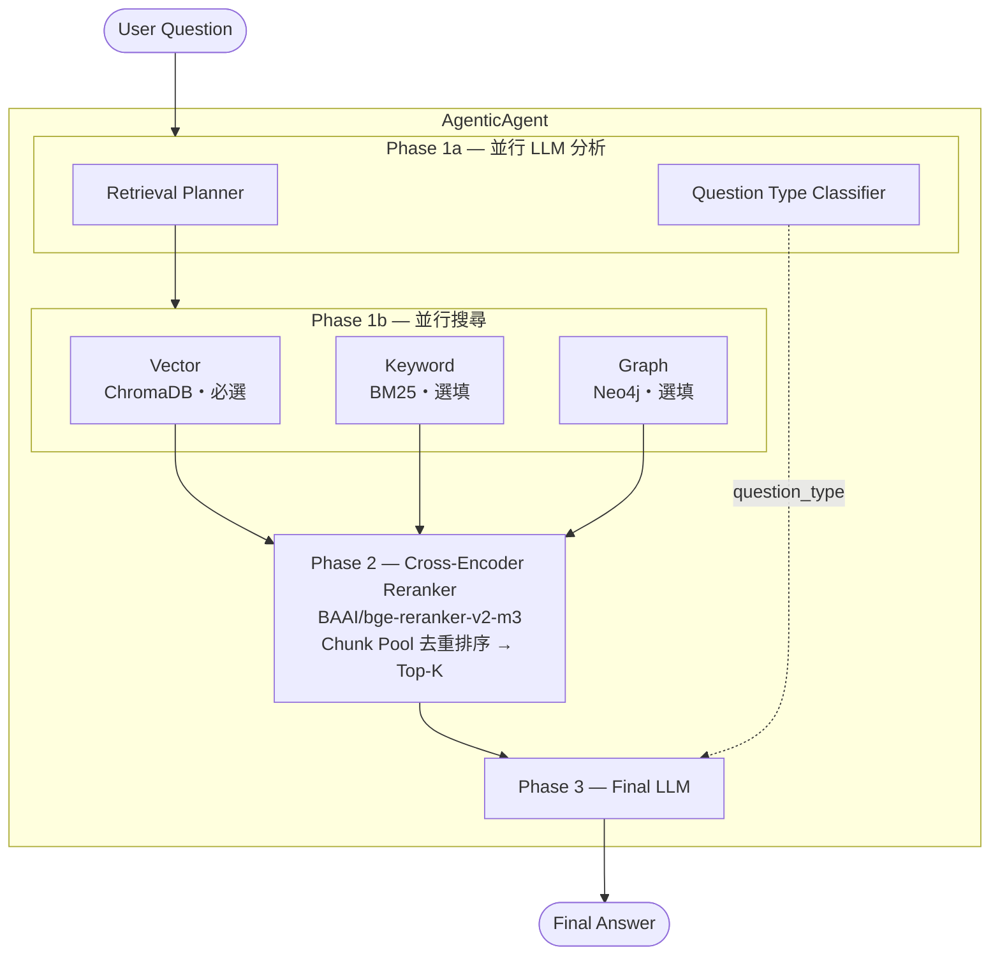

# BEARS — Agentic RAG System

BEARS 是一個基於 **單一 Agentic RAG 管線** 的問答系統。每個請求由 `AgenticAgent` 統一處理：先由輕量 LLM 決定啟用哪些檢索引擎，接著並行執行 Vector / BM25 / Graph 搜尋，最後以 Cross-Encoder 重排序後生成答案。

## 架構總覽


```mermaid
flowchart TD
    Q(["User Question"])

    subgraph AGENT["AgenticAgent"]
        subgraph P1A["Phase 1a — 並行 LLM 分析"]
            direction LR
            RP["Retrieval Planner<br/>"]
            QC["Question Type Classifier"]
        end

        subgraph P1B["Phase 1b — 並行搜尋"]
            direction LR
            V["Vector<br/>ChromaDB・必選"]
            K["Keyword<br/>BM25・選填"]
            G["Graph<br/>Neo4j・選填"]
        end

        RK["Phase 2 — Cross-Encoder Reranker<br/>BAAI/bge-reranker-v2-m3<br/>Chunk Pool 去重排序 → Top-K"]

        SY["Phase 3 — Final LLM "]
    end

    ANS(["Final Answer"])

    Q --> P1A
    RP --> P1B
    V & K & G --> RK
    RK --> SY
    QC -. question_type .-> SY
    SY --> ANS
```

## 目錄結構

```
BEARS/
├── src/bears/                         # 主要套件
│   ├── core/                          # 系統設定 + 實驗參數
│   │   ├── config.py                  #   Pydantic Settings（.env secrets）
│   │   ├── experiment.py              #   Pydantic BaseModel（YAML 實驗參數）
│   │   ├── dependencies.py            #   Singleton 容器（VectorStore / Reranker）
│   │   └── langfuse_helper.py         #   Langfuse observability（選填）
│   ├── database/                      # 資料層
│   │   ├── vector/                    #   ChromaDB 向量儲存
│   │   │   ├── vector_store.py        #     ChromaDB 連線 + CRUD
│   │   │   └── vector_builder.py      #     載入 corpus → 建立向量 DB
│   │   └── graph/                     #   Neo4j 圖譜儲存
│   │       ├── graph_store.py         #     Neo4j 連線 + CRUD
│   │       └── graph_builder.py       #     LLM 實體抽取 → 建立圖譜
│   ├── tools/                         # 搜尋工具層
│   │   ├── atomic/                    #   原子搜尋器（各自獨立、可並行）
│   │   │   ├── vector_retriever.py    #     ChromaDB 語義搜尋
│   │   │   ├── keyword_retriever.py   #     BM25 關鍵字搜尋（中英字符切分）
│   │   │   └── graph_retriever.py     #     Neo4j 圖譜搜尋
│   │   ├── comprehensive_search.py    #   並行調度 + 去重（ComprehensiveSearchTool）
│   │   └── reranker.py                #   CrossEncoderReranker（BAAI/bge-reranker-v2-m3）
│   ├── generators/                    # 生成器層（可插拔 domain generator）
│   │   ├── base.py                    #   BaseGenerator ABC
│   │   └── educational.py             #   EducationalGenerator（國小教師備課）
│   ├── agents/                        # Agent 層
│   │   ├── base.py                    #   BaseRAGAgent ABC + AgentResponse
│   │   ├── registry.py                #   Agent 註冊表（動態 import）
│   │   └── agentic_agent/             #   主要 Agent（單程管線）
│   │       ├── agent.py               #     AgenticAgent 實作
│   │       └── prompts.py             #     Retrieval Planner / Final Generation prompts
│   ├── orchestrator/                  # 編排層（輕量入口）
│   │   └── graph.py                   #   run_orchestrated_rag()：呼叫 AgenticAgent
│   └── api/                           # Web API（FastAPI）
│       ├── api.py                     #   FastAPI 應用入口（含 lifespan preload）
│       ├── schemas.py                 #   Request / Response Pydantic 模型
│       └── routes/                    #   API 路由
│           ├── query.py               #     /retrieve、/generate、/evaluate、/history、/health
│           ├── documents.py           #     /api/docs/{doc_id}
│           └── experiments.py         #     /api/experiments CRUD
├── frontend/                          # 前端（React + Vite）
│   └── src/
│       ├── pages/                     #   Chatbot、EvalBatch 兩頁
│       └── services/                  #   api.js（axios 封裝）
├── scripts/
│   └── build_db.py                    #   建立向量 + 圖譜資料庫
├── experiments/                       # 實驗參數 YAML（進 git）
│   └── default.yaml
├── data/                              # 資料
│   ├── corpus.json                    #   ~4200 篇文件
│   ├── queries.json                   #   ~647 題評估問題
│   └── chroma_db_corpus/              #   ChromaDB 持久化資料
├── output/                            # 評估結果輸出（不進 git）
├── pyproject.toml
└── .env.example
```

## 快速開始

### 前置需求

- Python >= 3.11
- [uv](https://docs.astral.sh/uv/)（套件管理器）
- OpenAI API Key
- Neo4j 資料庫（Graph 搜尋需要，可選用）

### 1. 安裝

```bash
git clone <repo-url> && cd BEARS

# 安裝所有依賴
uv sync
```

### 2. 設定 Neo4j（Graph 搜尋需要）

#### 2.1 下載 Neo4j Desktop

前往 [neo4j.com/download/](https://neo4j.com/download/) 下載 Neo4j Desktop：


#### 2.2 建立實例

開啟 Neo4j Desktop，點擊右上角 **Create instance**：


#### 2.3 匯入備份檔案

在 Create Instance 對話框中，展開底部的 **Load from .dump, .backup or .tar (optional)**，放入備份檔案：


#### 2.4 填寫資訊

填入 Instance name、密碼，並確認已選擇備份檔案，點擊 **Create**：


#### 2.5 啟動資料庫

建立完成後，點擊 **Start instance** 啟動資料庫：


#### 2.6 點選插件按鈕

在實例頁面中，點擊右側的 **Plugins** 標籤：


#### 2.7 安裝 APOC 插件

找到 **APOC** 插件，點擊 **Install** 安裝。此插件為必要依賴，未安裝會導致程式執行錯誤：


### 3. 設定 Langfuse（LLM 追蹤）

前往 [us.cloud.langfuse.com](https://us.cloud.langfuse.com) 註冊並登入。

#### 3.1 建立組織

在開始頁面點擊 **+ New Organization**：


輸入組織名稱，點擊 **Create**：


#### 3.2 建立專案

輸入專案名稱（如 `BEARS`），點擊 **Create**：


#### 3.3 建立 API 金鑰

進入 **Settings → API Keys**，點擊 **+ Create new API keys**，將產生的 Secret Key 和 Public Key 記下，稍後填入 `.env`：


### 4. 設定環境變數

```bash
cp .env.example .env
```

編輯 `.env`，填入 API Key、Neo4j 連線資訊（步驟 2）和 Langfuse 金鑰（步驟 3）：

```env
OPENAI_API_KEY=sk-...
NEO4J_URI=neo4j://127.0.0.1:7687
NEO4J_USERNAME=neo4j
NEO4J_PASSWORD=your_password
LANGFUSE_SECRET_KEY=sk-lf-...
LANGFUSE_PUBLIC_KEY=pk-lf-...
LANGFUSE_HOST=https://us.cloud.langfuse.com
```

> **Note**：若不需要 Graph 搜尋，可跳過步驟 2，`NEO4J_*` 留空；系統啟動時 `GraphStoreManager` 會連線失敗但不影響 Vector + BM25 管線運作。

### 5. 建立向量資料庫

```bash
# 建立向量 + 圖譜資料庫
uv run python scripts/build_db.py

# 只建向量（ChromaDB）
uv run python scripts/build_db.py --vector-only

# 只建圖譜（Neo4j）
uv run python scripts/build_db.py --graph-only

# 限制文件數量（快速測試）
uv run python scripts/build_db.py --limit 100
```

## 使用方式

### 啟動 API Server + 前端

```bash
# 後端（FastAPI，port 8005）
uv run uvicorn bears.api.api:app --reload --port 8005

# 前端（React + Vite，port 5173）
cd frontend
npm install    # 首次安裝
npm run dev
```

- **Swagger UI**：http://127.0.0.1:8005/docs
- **前端介面**：http://localhost:5173

> 前端 Vite dev server 已設定 proxy，所有 `/api` 請求自動轉發到 `http://localhost:8005`。

### Python API

```python
import asyncio
from bears.agents.registry import get_agent
from bears.core.experiment import ExperimentConfig

# 直接呼叫 AgenticAgent
exp = ExperimentConfig.from_yaml("experiments/default.yaml")
agent = get_agent("agentic", experiment=exp)
result = asyncio.run(agent.run("台灣第一座國家公園是哪座？"))
print(result.answer)
print(result.retrieved_doc_ids)

# 透過 Orchestrator 入口（與 API 相同路徑）
from bears.orchestrator.graph import run_orchestrated_rag
result = asyncio.run(run_orchestrated_rag("美國銷售額第二大汽車租賃公司的執行長是誰？"))
print(result["answer"])
```

## 設定系統

BEARS 採用**雙層設定分離**設計：

| 層級           | 內容                             | 存放方式                                    | 進 Git？ |
| -------------- | -------------------------------- | ------------------------------------------- | -------- |
| **系統設定** | API Keys、DB 連線、Langfuse      | `.env` (Pydantic Settings)                | 否       |
| **實驗參數** | model、top_k、reranker 等        | `experiments/*.yaml` (Pydantic BaseModel) | 是       |

### 建立新實驗

```yaml
# experiments/exp_topk10.yaml
model: "gpt-4o-mini"
temperature: 0.0
top_k: 10
rerank_alpha: 0.7
rerank_beta: 0.3
use_cross_encoder: true
reranker_model: "BAAI/bge-reranker-v2-m3"
graph_expansion_hops: 2   # Graph 搜尋的跳數（1 = 1-hop, 2 = 2-hop subgraph）
agent: "agentic"
```

## 開發指南

### 新增一個 Generator（領域生成器）

若要支援新的回答風格（如法律、醫療），只需繼承 `BaseGenerator`：

1. 建立 `src/bears/generators/your_generator.py`：

```python
from bears.generators.base import BaseGenerator

class YourGenerator(BaseGenerator):
    SYSTEM_PROMPT = """你是 ... 的 AI 助理。
    
【參考資料】
{context_block}
"""
```

2. 在 `src/bears/api/routes/query.py` 的 `_get_generator()` 中登記名稱即可。

### 新增一個 Agent

1. 建立 `src/bears/agents/your_agent/agent.py`
2. 繼承 `BaseRAGAgent`，實作 `name`、`capabilities`、`run()`：

```python
from bears.agents.base import BaseRAGAgent, AgentCapability, AgentResponse
from bears.core.experiment import ExperimentConfig

class YourAgent(BaseRAGAgent):
    def __init__(self, experiment=None):
        self.exp = experiment or ExperimentConfig()

    @property
    def name(self) -> str:
        return "your_agent"

    @property
    def capabilities(self):
        return {AgentCapability.VECTOR_SEARCH}

    async def run(self, question, experiment=None) -> AgentResponse:
        # 你的 retrieval + generation 邏輯
        return AgentResponse(answer="...", retrieved_doc_ids=["doc_1"], confidence=0.8)
```

3. 在 `src/bears/agents/registry.py` 註冊：

```python
AGENT_REGISTRY["your_agent"] = {
    "module": "bears.agents.your_agent.agent",
    "class_name": "YourAgent",
    "enabled": True,
}
```

## Tech Stack

| 類別             | 技術                                         |
| ---------------- | -------------------------------------------- |
| LLM              | OpenAI GPT-4o-mini（可在 YAML 切換）         |
| 向量資料庫       | ChromaDB + OpenAI text-embedding-3-small     |
| 圖譜資料庫       | Neo4j + APOC                                 |
| Reranker         | BAAI/bge-reranker-v2-m3（本地 Cross-Encoder）|
| BM25 搜尋        | rank-bm25（字符級切分，中英通用）            |
| LLM 框架         | LangChain + LangGraph                        |
| Web API          | FastAPI（含 lifespan singleton preload）     |
| 前端             | React 19 + Vite                              |
| Observability    | Langfuse（選填）                             |
| 套件管理         | uv + pyproject.toml (hatchling)              |

## Web API

### API Endpoints

#### 查詢與評估 (`/api/`)

| Endpoint              | 方法 | 說明                                         |
| --------------------- | ---- | -------------------------------------------- |
| `/api/retrieve`     | POST | 執行 Agentic RAG，回傳 Q/A/Context + 計時   |
| `/api/generate`     | POST | Retrieve → 指定 Generator 二次生成           |
| `/api/evaluate`     | POST | 串流批次評估（NDJSON），儲存結果到 `output/` |
| `/api/history`      | GET  | 列出歷史評估結果檔案（最新 50 筆）           |
| `/api/history/{fn}` | GET  | 讀取特定歷史結果                             |
| `/api/health`       | GET  | Liveness check                               |

#### 文件查詢 (`/api/docs/`)

| Endpoint               | 方法 | 說明                               |
| ---------------------- | ---- | ---------------------------------- |
| `/api/docs/{doc_id}` | GET  | 根據 doc_id 查詢 ChromaDB 文件內容 |

#### 實驗參數 (`/api/experiments/`)

| Endpoint                    | 方法   | 說明             |
| --------------------------- | ------ | ---------------- |
| `/api/experiments`        | GET    | 列出所有實驗參數 |
| `/api/experiments`        | POST   | 建立新實驗參數   |
| `/api/experiments/{name}` | GET    | 讀取特定實驗參數 |
| `/api/experiments/{name}` | PUT    | 更新實驗參數     |
| `/api/experiments/{name}` | DELETE | 刪除實驗參數     |

### Retrieve 回應格式

```json
{
  "question": "台灣第一座國家公園是哪座？",
  "answer": "墾丁國家公園",
  "context": ["[1][vector] 墾丁國家公園成立於...", "..."],
  "retrieval_time": 0.85,
  "generation_time": 1.23,
  "total_time": 2.08,
  "prompt_tokens": 1500,
  "completion_tokens": 80,
  "total_tokens": 1580,
  "tool_used": ["vector", "keyword"]
}
```

### Evaluate 串流格式

`POST /api/evaluate` 回傳 **NDJSON** 串流，每行一筆結果：

```jsonl
{"question":"...","answer":"...","context":[...],"total_time":2.1,"_progress":{"current":1,"total":10}}
{"question":"...","answer":"...","context":[...],"total_time":1.8,"_progress":{"current":2,"total":10}}
{"_done":true,"output_file":"output/eval_20260501_120000.json","count":10}
```

## Frontend Dashboard

React + Vite 建構的前端介面，含兩個主要頁面：

| 頁面            | 說明                                                                           |
| --------------- | ------------------------------------------------------------------------------ |
| **Chatbot**   | 即時問答介面，呼叫 `/api/generate`，以 `educational` generator 組成回答       |
| **EvalBatch** | 批次評估控制台：上傳 queries、設定實驗參數、串流進度、查看歷史結果與圖表比較  |

```bash
cd frontend
npm install          # 首次安裝依賴
npm run dev          # 啟動開發伺服器（http://localhost:5173）
```

## CI / 自動化

### Claude Code Review

本 repo 啟用了 **Claude Code Review GitHub Action**，每當 PR 被開啟、更新或重新開啟時，會自動由 Claude 進行程式碼審查並在 PR 留下回饋。

- **觸發時機**：`pull_request` 事件（`opened` / `synchronize` / `ready_for_review` / `reopened`）
- **執行方式**：透過 [`anthropics/claude-code-action`](https://github.com/anthropics/claude-code-action) 以直接 prompt 呼叫 Claude，並透過 `--allowedTools` 明確授權 `gh pr` 子指令與 inline-comment MCP 工具
- **驗證方式**：Pro / Max 訂閱的 OAuth Token（儲存在 repo secret `CLAUDE_CODE_OAUTH_TOKEN`）
- **設定檔**：`.github/workflows/claude-code-review.yml`

#### 審查重點

Claude 會針對以下面向給出評論：

- 程式碼品質與最佳實踐
- 潛在 bug 與邊界情境
- 安全性議題（OWASP 常見漏洞、敏感資訊外洩）
- 效能瓶頸與資源使用
